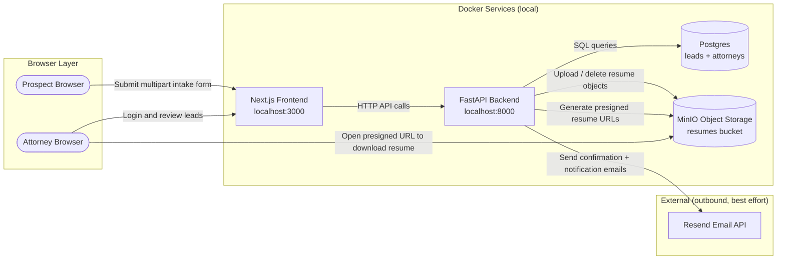
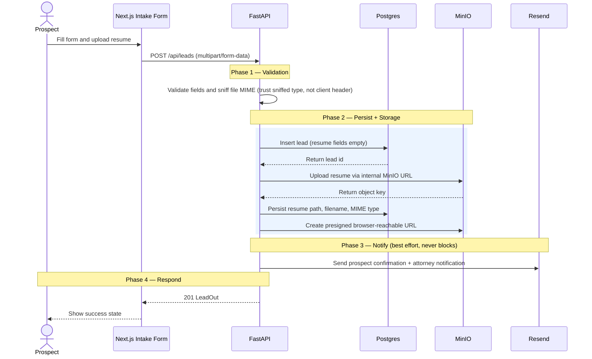
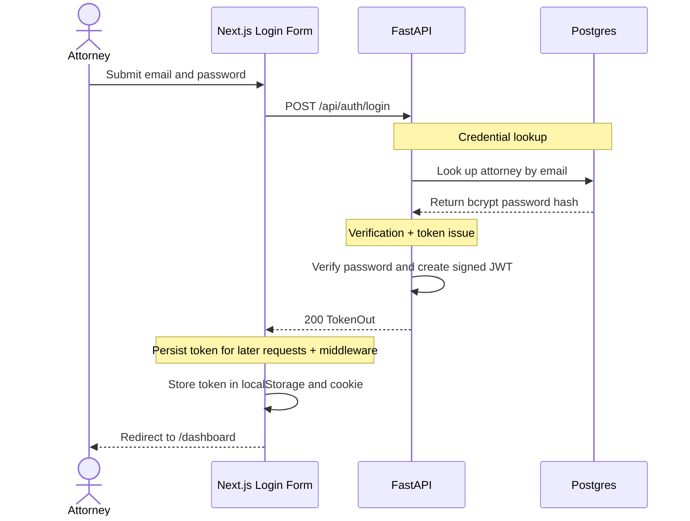
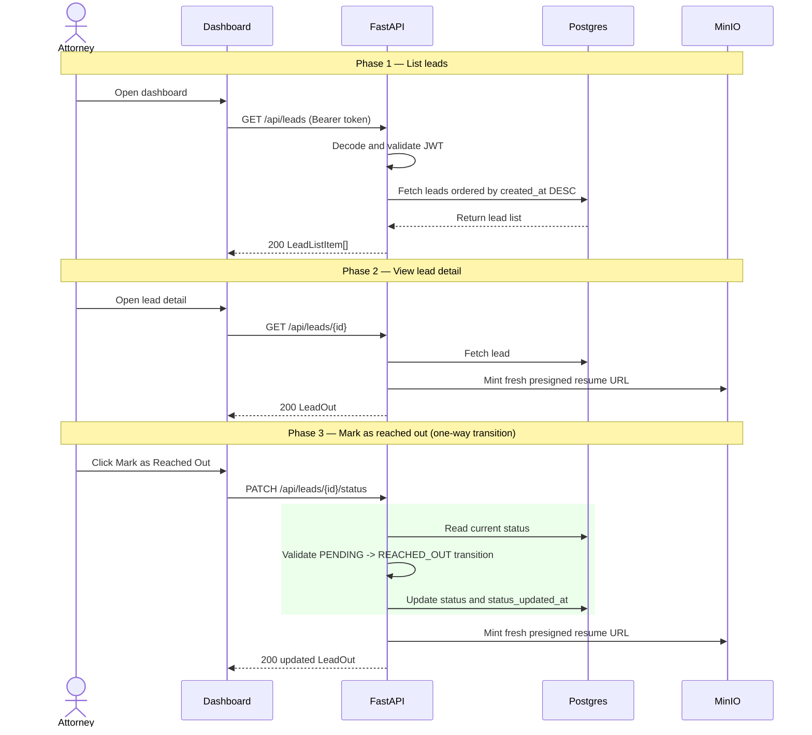

# System Design: Alma Lead Management

**Stack:** FastAPI · Next.js 16 · Postgres · MinIO · Resend · Docker Compose

---

## Overview

Prospects submit a public intake form (name, email, resume). The backend persists the lead in Postgres, stores the resume in MinIO, and sends non-blocking email notifications via Resend. Attorneys log in to a protected dashboard, review leads, download resumes via presigned URLs, and mark leads as reached out. The entire system runs locally with `docker compose up --build` — no external services required at runtime.

---

## Architecture

**Component layers:** Browser (Prospect + Attorney) → Docker services (Next.js :3000, FastAPI :8000, Postgres :5432, MinIO :9000) → External outbound (Resend, best-effort). The Attorney browser also opens presigned URLs directly against MinIO.

### Runtime Services

| Service | Role | Port |
|---|---|---|
| `frontend` | Next.js App Router — public intake + attorney dashboard | `3000` |
| `backend` | FastAPI — validation, auth, orchestration, presigned URLs | `8000` |
| `postgres` | Lead and attorney storage | `5432` |
| `minio` | S3-compatible resume object store | `9000`, `9001` |
| `minio-init` | One-time bucket creation | n/a |

### Backend Layers

| Layer | Modules | Responsibility |
|---|---|---|
| Routes | `routes_leads.py`, `routes_auth.py` | Request parsing, auth, orchestration |
| Deps | `deps.py` | Decode Bearer JWT for protected routes |
| Schemas | `schemas/lead.py`, `schemas/auth.py` | Pydantic request/response contracts |
| Domain | `models/lead.py` | LeadStatus enum, allowed types, transition rules |
| Repos | `lead_repository.py`, `attorney_repository.py` | Postgres reads/writes |
| Services | `file_validator`, `storage_service`, `email_service`, `auth_service` | Validation, MinIO, email, JWT |
| App shell | `main.py`, `config.py`, `db.py`, `exceptions.py` | Settings, pool, error mapping |

All domain exceptions live in `app/exceptions.py` and are mapped to HTTP status codes in `main.py`.

### Frontend

Next.js 16 App Router. The JWT is stored in both `localStorage["alma_token"]` (for API helpers) and an `alma_token` cookie (so Next.js middleware can guard `/dashboard/*` on the edge).

---

## API Contract

| Method | Path | Auth | Success | Failures |
|---|---|---|---|---|
| `POST` | `/api/auth/login` | None | `200 TokenOut` | `401`, `422` |
| `POST` | `/api/leads` | None | `201 LeadOut` | `409`, `422`, `500` |
| `GET` | `/api/leads` | Bearer | `200 LeadListItem[]` | `401`, `422` |
| `GET` | `/api/leads/{id}` | Bearer | `200 LeadOut` | `401`, `404`, `422` |
| `PATCH` | `/api/leads/{id}/status` | Bearer | `200 LeadOut` | `401`, `404`, `409`, `422` |
| `GET` | `/health` | None | `200` | n/a |

---

## Key Data Flows

### 1. Prospect submits a lead

- Validate fields + sniff file MIME (extension allow-list, magic bytes, MIME/ext cross-check).
- Insert lead in Postgres first — MinIO path requires the generated `lead_id`.
- Upload resume via internal MinIO client (`minio:9000`); persist path/filename/MIME to Postgres.
- Mint presigned browser URL via separate presign client (`localhost:9000`).
- Send emails via Resend — best-effort, never blocks the 201 response.
- On upload failure: delete lead. On metadata failure: delete object + delete lead.

### 2. Attorney signs in

- `POST /api/auth/login` → bcrypt verify → sign JWT (attorney ID + email + expiry).
- Frontend stores token in localStorage and cookie; middleware reads cookie to guard `/dashboard/*`.

### 3. Attorney reviews and marks a lead

- `GET /api/leads` — decode JWT, return leads ordered by `created_at DESC`.
- `GET /api/leads/{id}` — fetch lead, mint fresh presigned resume URL.
- `PATCH /api/leads/{id}/status` — validate `PENDING → REACHED_OUT` (one-way); update `status_updated_at`; mint fresh URL.
- Re-marking `REACHED_OUT` returns `409 Conflict`.

---

## Presigned URL Strategy

SigV4 signatures include the hostname, so the app uses two MinIO clients: an **internal upload client** (`minio:9000`) for uploads/deletes inside Docker, and a **browser presign client** (`localhost:9000`) for generating URLs the browser can open. Presigned URLs are minted fresh on every response — never stored in the DB.

| Client | Endpoint | Used For |
|---|---|---|
| Internal upload client | `http://minio:9000` | Uploading and deleting objects from inside Docker |
| Browser presign client | `http://localhost:9000` | Generating URLs the browser can open |

---

## Key Design Trade-Offs

| Decision | Rationale | Production gap |
|---|---|---|
| Local MinIO | Fully local — no cloud infra for reviewers | No lifecycle policies, IAM, or encryption config |
| JWT + localStorage + cookie | Simple; cookie enables middleware route guard without a session service | HTTP-only secure cookie preferred in prod |
| Non-blocking email | Resend failure never blocks lead creation | Failed notifications need monitoring/retries |
| No pagination | Keeps API simple for assignment scope | Needs pagination + server-side sort at volume |
| Single seeded attorney | Easy local review | Needs invitation flow, RBAC, password reset |
| Manual compensation | Consistent without queues or sagas | Staged states + background reconciliation for higher reliability |

---

## Security

- All dashboard APIs require a Bearer JWT; backend validates every request.
- Passwords stored as bcrypt hashes.
- Resumes are private; access only via expiring presigned URLs.
- File type gated by backend MIME sniffing — client `Content-Type` header is ignored.
- Only `NEXT_PUBLIC_API_URL` is in the frontend bundle. All secrets stay server-side.
- CORS restricted to `localhost:3000`.
