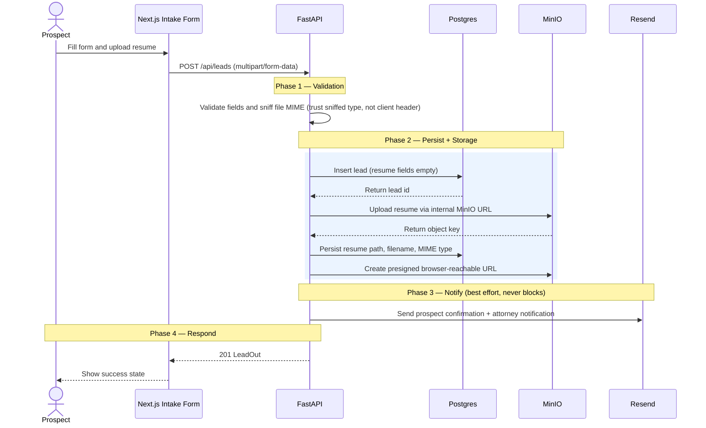
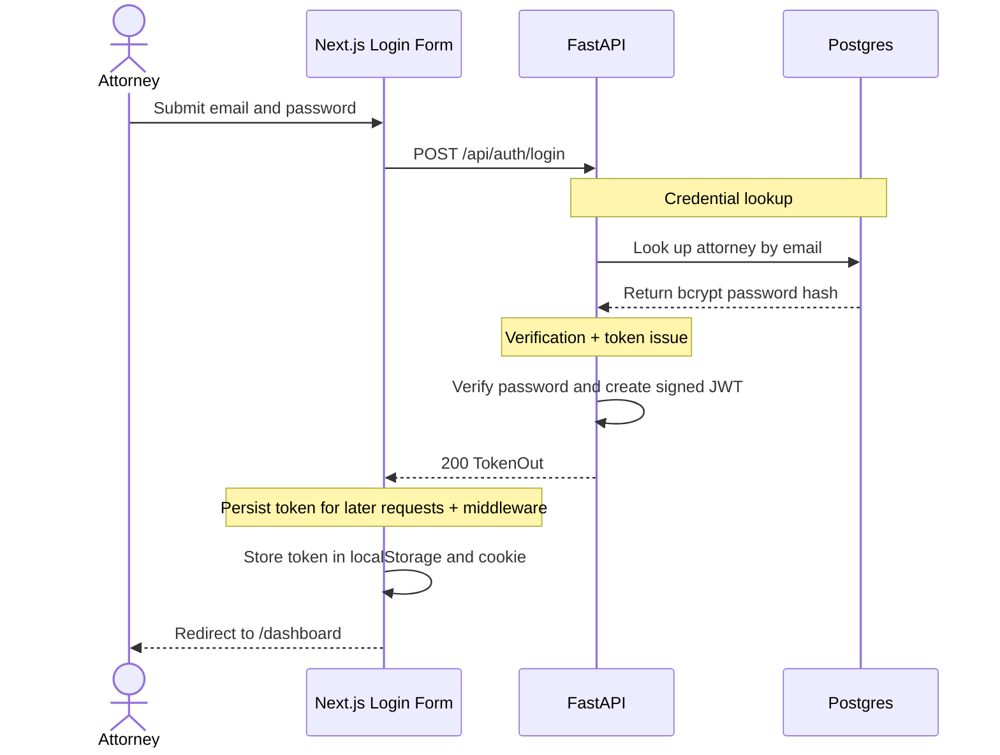
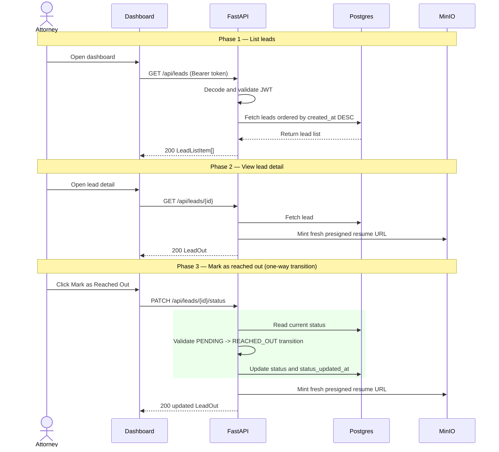

# System Design: Alma Lead Management

## Overview

This app supports a simple lead-management workflow for Alma:

1. A prospect submits a public intake form with their name, email, and resume.
2. The backend saves the lead to Postgres and the resume to local object storage.
3. The app sends non-blocking email notifications to the prospect and attorney.
4. An attorney signs in to a protected dashboard to review leads, download resumes, and mark leads as reached out.

It runs fully locally with one command:

```bash
docker compose up --build
```

The stack is FastAPI, Next.js, Postgres, MinIO, and Resend. Postgres and MinIO run as local Docker services. Resend is best-effort: email failures are logged and never block lead submission.

## Goals

- Provide a complete end-to-end intake and review workflow.
- Keep local setup simple and reproducible for reviewers.
- Cleanly separate API, persistence, file storage, email, and UI.
- Preserve data consistency when resume upload or metadata persistence fails.
- Protect internal review screens behind authentication.
- Keep sensitive operations on the backend, not in the browser.

## Non-Goals

- Multi-tenant attorney management.
- Password reset or invitation flows.
- Pagination and search for large lead volumes.
- Public resume access without signed URLs.
- Production-grade email retry queues or background workers.
- Full audit logging for every attorney action.

## Component Diagram


## Runtime Services

| Service | Responsibility | Local Port |
|---|---|---|
| `frontend` | Next.js App Router UI for public intake and attorney dashboard | `3000` |
| `backend` | FastAPI API, validation, auth, orchestration, presigned URL creation | `8000` |
| `postgres` | Durable relational storage for leads and attorneys | `5432` |
| `minio` | Local S3-compatible object storage for uploaded resumes | `9000`, `9001` |
| `minio-init` | One-time bucket creation for the `resumes` bucket | n/a |

## Backend Architecture

The backend is organized into explicit layers:

| Layer | Modules | Responsibility |
|---|---|---|
| API routes | `routes_leads.py`, `routes_auth.py` | Parse requests, apply auth dependencies, orchestrate service calls |
| Dependencies | `deps.py` | Decode Bearer JWTs for protected routes |
| Schemas | `schemas/lead.py`, `schemas/auth.py` | Pydantic request and response contracts |
| Domain model | `models/lead.py` | Lead status enum, allowed file types, status transition rules |
| Repositories | `lead_repository.py`, `attorney_repository.py` | Postgres reads and writes |
| Services | `file_validator.py`, `storage_service.py`, `email_service.py`, `auth_service.py` | File validation, MinIO access, email sending, JWT creation |
| App shell | `main.py`, `config.py`, `db.py`, `exceptions.py` | Settings, connection pool, app wiring, global error mapping |

Domain exceptions are centralized in `app/exceptions.py` and mapped to HTTP responses in `main.py`, keeping route code readable and the error contract consistent.

## Frontend Architecture

The frontend uses Next.js 16 App Router, with client-side interactivity where needed:

| Area | Files | Responsibility |
|---|---|---|
| Public intake | `app/page.tsx`, `components/IntakeForm.tsx` | Prospect form, client-side validation, multipart submission |
| Login | `app/login/page.tsx`, `components/LoginForm.tsx` | Attorney login and token persistence |
| Dashboard | `app/dashboard/page.tsx`, `LeadTable`, `StatusFilter`, `StatusBadge` | Protected lead list, filtering, empty/loading states |
| Detail | `app/dashboard/[id]/page.tsx`, `MarkReachedOutButton` | Lead detail, resume download link, status transition |
| API client | `lib/api.ts` | Typed fetch helpers and frontend error mapping |
| Auth storage | `lib/auth.ts`, `middleware.ts` | Token in localStorage and cookie, dashboard route guard |

The browser stores the JWT in two places:

- `localStorage["alma_token"]`, used by frontend API helpers.
- `alma_token` cookie, used by Next.js middleware to guard `/dashboard/*`.

## Data Model

### `leads`

Stores prospect information, resume metadata, and review status.

Key fields:

- `id`: UUID primary key.
- `first_name`, `last_name`, `email`: prospect identity and contact info.
- `resume_path`: MinIO object key.
- `resume_filename`: original sanitized filename.
- `resume_content_type`: MIME type sniffed by the backend.
- `status`: `PENDING` or `REACHED_OUT`.
- `status_updated_at`: timestamp of the current status.
- `created_at`, `updated_at`: record timestamps.

The `email` field is unique. Emails are normalized before insert, and duplicates return `409 Conflict`.

### `attorneys`

Stores local seeded attorney credentials:

- `id`: UUID primary key.
- `email`: unique login email.
- `password_hash`: bcrypt hash.
- `created_at`: seed timestamp.

This assignment uses one seeded attorney account for local review.

## API Contract

| Method | Path | Auth | Success | Expected Failures |
|---|---|---|---|---|
| `POST` | `/api/auth/login` | None | `200 TokenOut` | `401`, `422` |
| `POST` | `/api/leads` | None | `201 LeadOut` | `409`, `422`, `500` |
| `GET` | `/api/leads` | Bearer token | `200 LeadListItem[]` | `401`, `422` |
| `GET` | `/api/leads/{id}` | Bearer token | `200 LeadOut` | `401`, `404`, `422` |
| `PATCH` | `/api/leads/{id}/status` | Bearer token | `200 LeadOut` | `401`, `404`, `409`, `422` |
| `GET` | `/health` | None | `200` | n/a |

## Primary Data Flows

### 1. Prospect submits a lead



The lead is inserted before the upload because the MinIO object key includes the generated lead ID.

### 2. Attorney signs in



The API returns a signed JWT. Protected requests send it as `Authorization: Bearer <token>`.

### 3. Attorney reviews and marks a lead as reached out



Status transitions are one-way. Re-marking a lead as `REACHED_OUT` returns `409 Conflict`.

## File Upload and Storage Strategy

Resumes live in MinIO, a local S3-compatible object store. The bucket is private and created by the `minio-init` container at startup.

Object key format:

```text
{lead_id}/{sanitized_filename}
```

The backend never trusts the browser-provided content type. All upload validation runs through `validate_resume()`, which checks:

- File size.
- Extension allow-list.
- Magic-byte MIME sniffing.
- MIME and extension compatibility.

Allowed types are PDF, DOC, DOCX, PNG, JPG, and JPEG. The sniffed MIME type is stored in Postgres and passed to MinIO.

## Presigned URL Strategy

The app uses two MinIO clients:

| Client | Endpoint | Used For |
|---|---|---|
| Internal upload client | `http://minio:9000` | Uploading and deleting objects from inside Docker |
| Browser presign client | `http://localhost:9000` | Generating URLs that the browser can open |

The split matters because S3 SigV4 signatures include the hostname. A URL signed for `minio:9000` works inside the Docker network but is unreachable from the browser; a URL signed for `localhost:9000` is browser-reachable and must not be post-processed after signing.

Presigned URLs are not stored in the database. They are minted fresh when needed and expire after `PRESIGNED_URL_TTL_SECONDS`.

## Consistency and Failure Handling

The create-lead flow touches both Postgres and MinIO, creating a partial-write risk. The backend handles it with explicit compensation:

1. Insert the lead first so the storage path can include `lead_id`.
2. If resume upload fails, delete the lead record.
3. If resume metadata persistence fails after upload, delete the MinIO object and the lead record.
4. If email sending fails, keep the lead and return success.

Email is deliberately outside the critical path: a prospect should not lose a successful submission because a notification provider is down.

## Authentication and Authorization

Authentication is JWT-based:

- `POST /api/auth/login` validates attorney credentials against bcrypt hashes in Postgres.
- The backend signs a JWT containing the attorney ID, email, and expiration.
- The frontend stores the token in localStorage for API calls.
- The frontend also writes the same token to an `alma_token` cookie so Next.js middleware can guard `/dashboard/*`.
- Protected routes decode the Bearer token and return `401 Unauthorized` for missing, malformed, expired, or invalid tokens.

The dashboard route guard is a frontend convenience, not the security boundary; the backend validates every protected request.

## Security Considerations

- Dashboard APIs require a Bearer token.
- Passwords are stored as bcrypt hashes.
- Resume objects are private and accessed through expiring presigned URLs.
- File type validation uses backend MIME sniffing, not client headers.
- Only `NEXT_PUBLIC_API_URL` is exposed to the frontend bundle.
- JWT secret, database URL, MinIO credentials, and Resend key stay server-side.
- CORS is restricted to the local frontend origin.

For production, next steps include HTTPS-only cookies, stronger secret management, token refresh or shorter sessions, rate limiting, structured audit logging, and a production object-storage provider.

## Local Deployment Design

Docker Compose is the deployment boundary for this assignment.

Startup order:

1. `postgres` starts and runs SQL migrations on a fresh volume.
2. `minio` starts and exposes local object storage.
3. `minio-init` waits for MinIO health and creates the resume bucket.
4. `backend` waits for Postgres and `minio-init`.
5. `frontend` starts after the backend is available.

This keeps setup reviewer-friendly while still representing a realistic multi-service application.

## Testing Strategy

Backend tests cover:

- Lead status transition rules.
- Schema normalization and validation.
- File validation behavior.
- Repository and service behavior.
- Route integration paths with mocked I/O dependencies.
- Auth behavior and error mapping.

Frontend tests cover:

- Intake form success, duplicate, and error states.
- Auth token storage behavior.
- API helper behavior for success and failure responses.
- Mark-reached-out button behavior.

Testing targets the seams most prone to regression: validation, authentication, status transitions, error mapping, and frontend state handling.

## Trade-Offs

### Local MinIO instead of hosted object storage

MinIO keeps the assignment fully local, so reviewers need no cloud infrastructure. The trade-off is that production object-storage concerns such as lifecycle policies, encryption, and IAM are not represented.

### JWT plus localStorage and cookie

Storing the token in localStorage (for API helpers) and a cookie (for middleware) keeps the frontend simple and enables route guarding without a session service. In production, an HTTP-only secure cookie would be preferable.

### Non-blocking email delivery

Email failures are logged but do not fail lead creation, improving reliability for the prospect and decoupling core data capture from an external provider. The trade-off is that failed notifications would need monitoring or retries in production.

### No pagination

The dashboard fetches all leads and filters by status, which keeps the API simple and is fine for a take-home. At higher volume, the list endpoint should add pagination, search, and server-side sorting.

### Single seeded attorney

One seeded account makes local review easy. Production would add attorney management, invitations, role-based access, password reset, and audit trails.

### Manual compensation instead of distributed transactions

Postgres and MinIO can't share one atomic transaction, so manual compensation keeps the system consistent without queues or sagas. For higher reliability, upload and lead creation could be split into staged states with background reconciliation.

## Future Improvements

- Add pagination and search to the dashboard.
- Add audit events for login, resume downloads, and status changes.
- Add attorney invitation and password reset flows.
- Add background email retries with a job queue.
- Add rate limiting for public lead submissions and login attempts.
- Add malware scanning for uploaded resumes.
- Add production secret management and HTTPS-only cookie auth.
- Add object lifecycle cleanup for abandoned or deleted leads.

## Summary

The system prioritizes a reliable, reviewer-friendly local experience while keeping production-style boundaries. FastAPI owns validation, authentication, persistence orchestration, and presigned URL generation; Next.js owns the public intake and attorney review experience. Postgres stores structured lead data, MinIO stores private resume files, and Resend provides best-effort notifications.

The key design decision is the split between internal MinIO access and browser-reachable presigned URLs: it keeps uploads working inside Docker while producing resume links attorneys can actually open from the browser.
